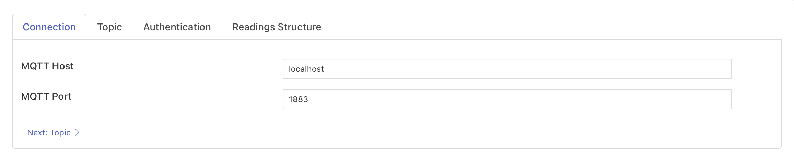
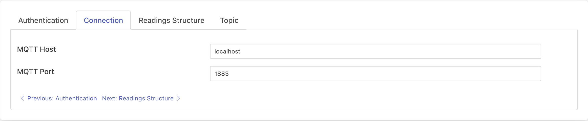
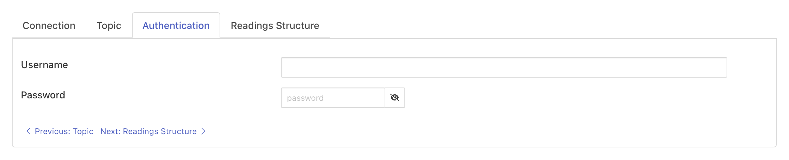
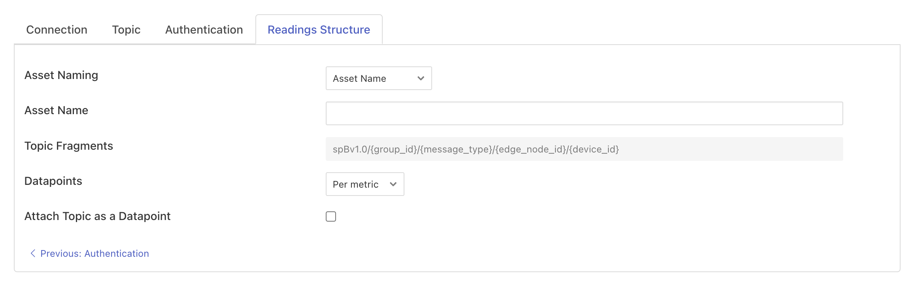
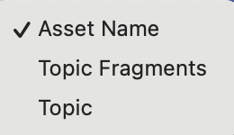
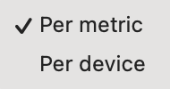

.. Images

MQTT Sparkplug B
================

The *fledge-south-mqtt-sparkplug* plugin implements the Sparkplug B payload format with an MQTT (Message Queue Telemetry Transport) transport. The plugin will subscribe to a configured topic and will process the Sparkplug B payloads, creating Fledge assets form those payloads. Sparkplug is an open source software specification of a payload format and set of conventions for transporting sensor data using MQTT as the transport mechanism.

.. note::

   Sparkplug is bi-directional, however this plugin will only read data from the Sparkplug device.

To create a south service with the MQTT Sparkplug B plugin

- Click on *South* in the left hand menu bar

- Select *mqtt_sparkplug* from the plugin list

- Name your service and click *Next*

=============
Configuration
=============

The configuration parameters that can be set on this page are divided into a set of tabs;

  - Connection
  - Topic
  - Authentication
  - Readings Structure

    The Connection configuration tab is shown below:

    +---------------+
    | |sparkplug_1| |
    +---------------+

    - **MQTT Host**: The MQTT host to connect to, this is the host that is running the MQTT broker.
    - **MQTT Port**: The MQTT port, this is the port the MQTT broker uses for unencrypted traffic, usually 1883 unless modified.

    The Topic configuration tab is shown below:

        +---------------+
        | |sparkplug_2| |
        +---------------+

        - **Topic**: The MQTT topic to which the plugin will subscribe.

    The Authentication configuration tab is shown below:

    +---------------+
    | |sparkplug_3| |
    +---------------+

    - **Username**: The user name to be used when authenticating with the MQTT subsystem.
    - **Password**: The password to be used when authenticating with the MQTT subsystem.

    The Readings Structure configuration tab is shown below:

    +---------------+
    | |sparkplug_4| |
    +---------------+

    - **Asset Naming**: Asset naming for reading objects. The available options are as follows:

        +-----------------+
        | |sparkplug_4.1| |
        +-----------------+

        - *Asset Name*: Fixed asset name. If the asset name is left empty or only contains whitespace then the topic of the incoming MQTT message will be used as the asset name.
        - *Topic Fragments*: The asset name will be constructed based on the subscribed MQTT topic. The placeholder components within the Sparkplug B topic will be replaced with corresponding values from the subscribed topic. For example, {message_type} will be replaced with the appropriate value, such as DBIRTH, DDATA, DDEATH, etc., as defined for the topic.
        - *Topic*: Asset name will be same as subscribed topic.

    - **Datapoints**: To construct readings datapoints from the received data attributes on topic

        +-----------------+
        | |sparkplug_4.2| |
        +-----------------+

        - *Per metric*: Each metric will be stored as an individual reading.
        - *Per Device*: All the metrics in the payload will be stored as a single reading, where each metric will be datapoint as reading attribute.

    - **Attach Topic as a Datapoint**: It allows attaching the subscribed topic as an additional datapoint within the reading object. This reading attribute serves as metadata associated with the reading.

- Click *Next*

- Enable the service and click on *Done*

