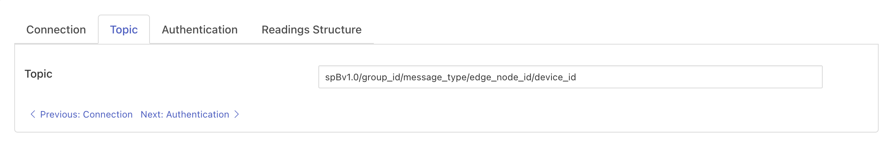

.. Images

.. |sparkplug_3| image:: images/sparkplug_3.jpg
.. |sparkplug_3.1| image:: images/sparkplug_3.1.jpg
.. |sparkplug_3.2| image:: images/sparkplug_3.2.jpg

MQTT Sparkplug B
================

The *fledge-south-mqtt-sparkplug* plugin implements the Sparkplug B payload format with an MQTT (Message Queue Telemetry Transport) transport. The plugin will subscribe to a configured topic and will process the Sparkplug B payloads, creating Fledge assets form those payloads. Sparkplug is an open source software specification of a payload format and set of conventions for transporting sensor data using MQTT as the transport mechanism.

.. note::

   Sparkplug is bi-directional, however this plugin will only read data from the Sparkplug device.

To create a south service with the MQTT Sparkplug B plugin

- Click on *South* in the left hand menu bar

- Select *mqtt_sparkplug* from the plugin list

- Name your service and click *Next*

The configuration parameters that can be set on this page are divided into a set of tabs;

  - Authentication
  - Connection
  - Readings Structure
  - Topic

Authentication Configuration
----------------------------
The Authentication configuration tab is shown below:

+---------------+
| |sparkplug_1| |
+---------------+

- **Username**: The user name to be used when authenticating with the MQTT subsystem.
- **Password**: The password to be used when authenticating with the MQTT subsystem.

Connection Configuration
------------------------
The Connection configuration tab is shown below:

+---------------+
| |sparkplug_2| |
+---------------+

- **MQTT Host**: The MQTT host to connect to, this is the host that is running the MQTT broker.
- **MQTT Port**: The MQTT port, this is the port the MQTT broker uses for unencrypted traffic, usually 1883 unless modified.

Readings Structure Configuration
--------------------------------
The Readings Structure configuration tab is shown below:

+---------------+
| |sparkplug_3| |
+---------------+

- **Asset Naming**: Asset naming which will be used to decide as follows:

    +-----------------+
    | |sparkplug_3.1| |
    +-----------------+

    - *Asset Name*: Fixed asset name.
    - *Topic Fragments*: Asset name as per topic fragments. Use Placeholders from {group_id}/{message_type}/{edge_node_id}/{device_id} and order matters. For example: {group_id}/{edge_node_id}, {group_id}/{device_id}, {edge_node_id}/{device_id}, {group_id}/{edge_node_id}/{device_id} etc.
    - *Topic*: Asset name will be same as subscribed topic.

- **Datapoints**: To construct readings datapoints from the received data attributes on topic

    +-----------------+
    | |sparkplug_3.2| |
    +-----------------+

    - *Per metric*: A single metric per asset.
    - *Per Device*: It allows all the metrics for a single device, as device by the topic structure to be created.

- **Attach Topic as a Datapoint**: Attach Topic as a Datapoint in Reading. By default it's value unchecked.

Topic Configuration
-------------------
The Topic configuration tab is shown below:

    +---------------+
    | |sparkplug_4| |
    +---------------+

    - **Topic**: The MQTT topic to which the plugin will subscribe.

- Click *Next*

- Enable the service and click on *Done*

